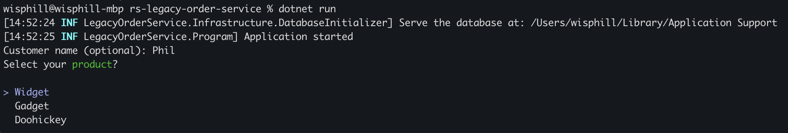

# rs-legacy-order-service

  
  
  
  

## Overview
`rs-legacy-order-service` is a .NET console application designed to process and manage orders using a local SQLite database. It can be run interactively for manual order entry or deployed on an EC2 instance for automated order processing.

## Prerequisites
- dotnet version: 10.0.102 or higher (for modern application)

## Added features
- As cli application, we should use the single database target. I replaced the database source in the built folder with the datasource in the local machine application data directory
- Enable WAL mode to increase the performance, it's safe to use with non-network storage volume
- Make sure if it's hosted on the EC2 machine, the data folder is mounted to external volume

## Deployment Notes
- For best performance, use non-network storage volumes.
- Ensure the database file is accessible and writable by the application.

## Usage
- This cli/console application can be hosted on the EC2 machine with EBS to process orders
- This console application can be used to interact and input the order manually

## Support
For issues or feature requests, please open an issue in the repository.